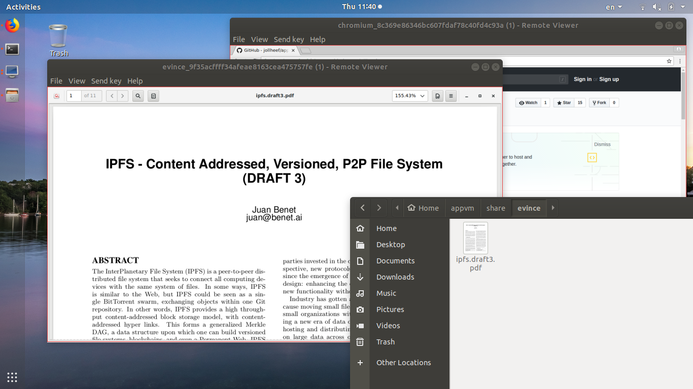

# Nix app vms

Simple application VM's based on Nix package manager.

Uses one **read-only** /nix directory for all appvms. So creating a new appvm (but not first) is just about one minute.

Designed primarily for full screen usage (but remote-viewer has ability to resize window dynamically without change resolution) without guest additions (because of **less attack surface**).

It's a proof-of-concept, but you can still use it. Also there is a lot of strange things inside, don't afraid of :)

## Install Nix package manager

    $ su -c 'mkdir -m 0755 /nix && chown user /nix'
    $ curl https://nixos.org/nix/install | sh

## Dependencies

    $ su -c 'USE="spice virtfs" emerge qemu virt-manager'

## Add appvm to PATH

    $ echo 'PATH=$PATH:$HOME/appvm/bin' >> ~/.bashrc

(if you clone appvm to home directory)

## Generate resolution

By default uses 3840x2160. If you need to regenerate `appvm/nix/monitor.nix`:

    $ appvm/appvm.sh generate-resolution 1920 1080 > appvm/nix/monitor.nix

Autodetection is a bash-spaghetti, so you need to check results. BTW it's just a X.org monitor section.

## Create VM

    $ $HOME/appvm/appvm.sh build chromium

You can customize local settings in `nix/local.nix`.

## Run application

    $ appvm.chromium

Default hotkey to release cursor: ctrl+alt.

## Shared directory

    $ ls appvm/share/chromium
    foo.tar.gz
    bar.tar.gz

## Close VM

    $ pkill.... :)

# App description

    $ cat nix/chromium.nix
    {pkgs, ...}:
    {
      imports = [
        <nixpkgs/nixos/modules/virtualisation/qemu-vm.nix>
        <nix/base.nix>
      ];

      environment.systemPackages = [ pkgs.chromium ];
      services.xserver.displayManager.sessionCommands = "while [ 1 ]; do ${pkgs.chromium}/bin/chromium; done &";
    }

For create new app you should add package name (search at https://nixos.org/nixos/packages.html) and path to binary (typically same as package name).

## Defined applications (pull requests are welcome!)

* chromium
* thunderbird
* tdesktop
* evince
* libreoffice
* wire
